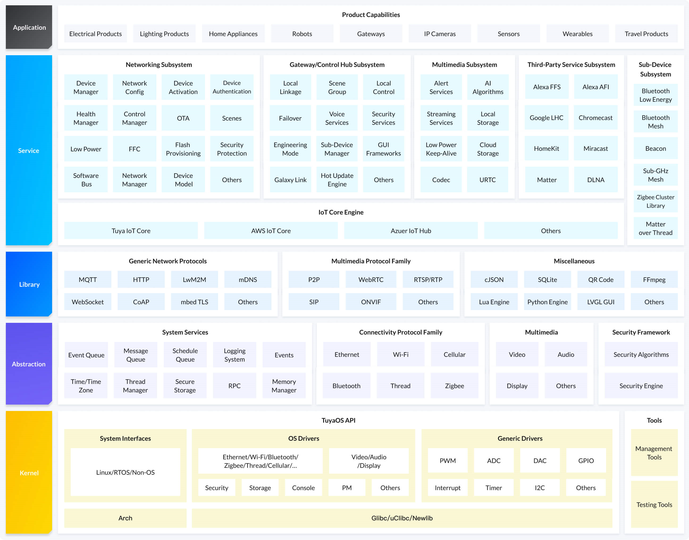

<p align="center">

</p>

[中文](README_zh.md) | [English](README.md)
## Overview

Built on top of the RTOS, Linux, and Non-OS, TuyaOS is a distributed and platform-agnostic IoT operating system. 

Backed by the TuyaOS kernel and various development components, TuyaOS is designed to tackle the heterogeneity of platforms, systems, protocols, and applications in order to enable quick and reliable integration, interconnection, interoperability, and compliance. The tiered and plug-and-play architecture design allows you to quickly tailor a development framework based on your hardware resources and use cases hence reducing the cost of development with high cost performance. Tuya’s proprietary things data model and software bus allow all TuyaOS-based products to be interconnected.





## Advantages
- **Cross-Platform**: TuyaOS has been designed to be easily adapted to different chip platforms, systems, and connectivity protocols.
- **Low-Code**: Various service subsystems enable quick product development of different types.
- **Versatile**: Diverse capabilities help you build products for different use cases in the IoT field.
- **Highly-Tailored**: The plug-and-play (PnP) layered architecture gives you the flexibility to tailor applications to your needs.
- **Interconnected**: Tuya’s proprietary things data model and software bus enable interconnection between devices across protocols.
- **Security compliance**: End-to-end security ensures data security and privacy and meets global compliance requirements.
- **Ecosystem integration**: Integrate your product with third-party ecosystems, such as Amazon, Google, Apple, and Matter.
- **Technology innovations**: Leverage Tuya’s proprietary technologies including Tuya FFC, Tuya Galaxy Link, Tuya IHU, Tuya U-RTC, and Tuya Flash Provisioning.


## Networked Product Development Framework
In the TuyaOS system, a networked product refers to a device that can be directly connected to the internet and independently operated.

- Networked products:
Smart devices connected over Ethernet, Wi-Fi, or Wi-Fi and Bluetooth combo, for example, electrical devices, lights, sensors, home appliances, health devices, pet care devices, and door locks.
- Non-networked products:
    - Gateway and central control: Typically, these devices are used to manage the sub-devices that are connected to them.
	- Smart devices connected over Zigbee, Bluetooth, Thread, or Sub-1 GHz: These devices are indirectly connected to the internet through gateways and mobile apps.
	- IPC or NVR devices: An independent development framework is provided to develop these devices.
	- Cellular devices: An independent development framework is provided to develop these devices.

### Networked Product Advantages

- **Cross-platform**: TuyaOS Kernel Layer (TKL) API tackles the heterogeneity of platforms, systems, and protocols, enabling you to develop once and deploy across platforms.
- **Low-code**: Unified business and driver frameworks allow you to focus on building applications without taking care of specific implementations. Various reference applications let you quickly implement device connectivity by editing the sample code.
- **Low-footprint**: Implement various features with constrained resources thanks to the high flash utilization backed by proprietary OTA technology. This makes it possible to achieve TuyaOS and Matter combo solutions on a system with 2 MB Flash and 256 KB RAM.
- **Feature-rich components**: A host of components covers basic services, security, networking middleware, and various IoT services, which can basically address all aspects of your IoT product. You can integrate with the Tuya ecosystem, Tuya-based mobile apps, and cloud services.
- **Stable and reliable**: `Powered by Tuya` device shipments are over 100 million each year, presenting the stability of TuyaOS Networked Product Development Framework.
- **Interconnection**: With the unified TuyaOS data point (DP) device model, devices can discover and talk to each other over internet or LAN and thus achieve cloud or LAN based automation.
- **Security and compliance**: Considering security and costs, different security levels are available to choose from based on your case. Secure data storage, identity authentication, and secure connection and communication are supported. Network access and data processing complies with the local regulations applicable to the protection of personal data, helping you roll out products globally.

### Networked Product Capability Map

* Device management
* Pairing and activation
* Device control
* Basic services
* Device driver
* Power management
* Scheduled task
* Update service
* Device accessory
* Device security
* Network
* System service


## Quick start

### Dependency

Some package dependencies need to be installed before compiling.
``` bash
$ sudo apt-get install build-essential wget git python3 libc6-i386 
```

### Get TuyaOS

Use git to download tuyaos to the local.
``` bash
$ git clone https://github.com/tuya/tuyaos-iot-wifi-ble-bk7231n.git
```

### Compile
The compile project is in the apps directory, you can quickly compile, burn, and run the process through tuya_demo_template. Use the following command in the root directory to compile:
``` bash
$ sh build_app.sh apps/tuyaos_demo_examples tuyaos_demo_examples 1.0.0
```
- apps/tuyaos_demo_examples: compile project path

- tuyaos_demo_examples: compile project name

- 1.0.0: The version of the current compilation firmware

### Compilation cleanup
You can clear the compiled intermediate files with the following commands:
``` bash
$ sh build_app.sh apps/tuyaos_demo_examples tuyaos_demo_examples 1.0.0 clean
```


## Code directory
```
|---apps                        #Applicaton programs
|---build                       #Compile configuration
|---include                     #Header files, including public header files and component header files
|---libs                        #The .a file of the independent link of tuyaos network single product
|---scripts                     #Compile scripts
|---vendor                      #Chip SDK
|---build_app.sh                #tuyaos compile entry
|---tools                       #Chip download tools
|---documentation
|---LICENSE
|---README.md
```


## Support and help

If you encounter problems during development, you can log in [ developer.tuya.com](https://developer.tuya.com/en/docs/iot-device-dev/TuyaOS-Overview?id=Kbfjtwjcpn1gc) find more information.
