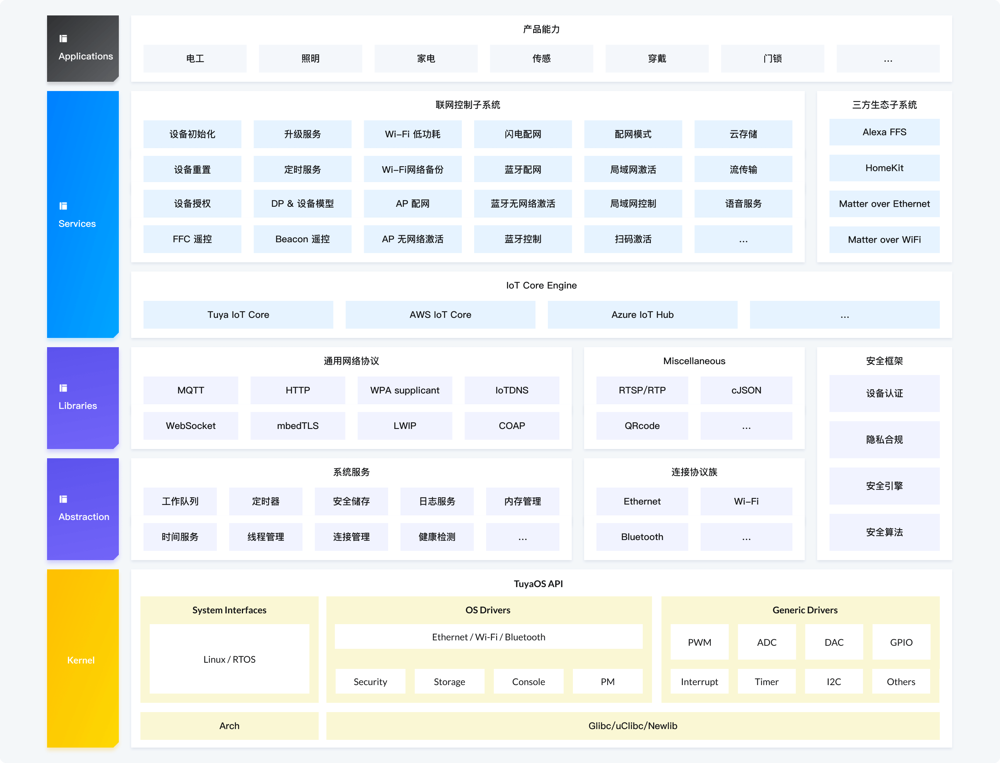

<p align="center">

</p>

[English](https://github.com/tuya/tuyaos-iot-wifi-ble-bk7231n/blob/master/README.md) | [中文]

# 概述
TuyaOS 是一种基于 RTOS、Linux、Non-OS 等内核设计的、应用于 IoT 领域、面向全连接、全场景的分布式跨平台操作系统。

基于 TuyaOS Kernel 及 TuyaOS 丰富的开发组件，使开发人员能够从不同的芯片平台、系统、连接协议及应用软件等碎片化开发体验中得到解放，只需专注于自身业务的创新及开发，并且一次开发、多端部署、全球可用、安全合规。整体架构采用分层、可插拔组件的方式设计，可根据芯片资源及应用场景自由裁剪，生成符合要求的开发框架。通过 Tuya 特有的物模型及自研软总线，使得所有采用 TuyaOS 开发的不同通信协议的产品之间能够互联互通。





## 核心竞争力

- **跨平台：** 满足开发者对不同芯片平台､ 系统､ 连接协议的开发需求。
- **低代码：** 提供丰富的业务子系统，可快速开发不同类型的产品。
- **多场景：** 满足物联网领域的全场景产品开发需求。
- **高可裁剪性：** 采用分层，可插拔组件设计，支持按需裁剪。
- **互联互通：** 自研高效的软总线和物模型，支持不同通讯协议的设备互联互通。
- **安全合规：** 提供多等级的全链路安全能力，满足全球合规要求。
- **生态多样：** 支持多种第三方生态互联互通，例如 Amazon、Google、Apple、Matter等。
- **技术创新：** 提供多种涂鸦自研技术：Tuya FFC、Tuya Galaxy Link 、Tuya IHU、Tuya U-RTC、Tuya Flash Provisioning 。


## 联网单品开发框架

在 TuyaOS 体系中，联网单品是指可以直接连接网络，完成独立的功能的设备。

- 是联网单品的智能设备：

	使用 Ethernet、Wi-Fi、Wi-Fi 和蓝牙双模连接方式的，例如电工、照明、传感、大小家电、健康、宠物、门锁等类型设备。

- 不是联网单品的智能设备：

	- 网关、中控：网关、中控功能很大一部分是管理网关、中控下接入的子设备。
	- Zigbee、蓝牙、Thread、Sub-1 GHz 协议类：Zigbee、蓝牙、Thread、Sub-1 GHz 类协议主要用来开发子设备产品，子设备产品依赖网关、App 联网，无法直接连接网络。
	- IPC、NVR：IPC 体系的设备，独立定义，独立输出开发框架。
	- 蜂窝协议类：蜂窝连接体系的设备，独立定义，独立输出开发框架。

### 联网单品优势

- **跨平台**：标准化的 TuyaOS Kernel Layer API（TKL）设计，满足不同芯片平台、系统、连接协议的开发需求，一次设备开发，可以在不同的芯片平台上使用。
- **低代码**：统一的业务框架、驱动框架，无需关心具体的实现原理，调用接口函数即可快速开发设备功能。同时提供了丰富的演示、测试程序，开发者仅需基于演示程序进行简单的改动，即可快速实现设备接入。
- **低资源**：在有限的资源上实现了丰富的功能，通过专有的 OTA 技术实现了极高的 Flash 利用率，甚至在 2M Flash 和 256K RAM 支持了 TuyaOS+Matter 方案。
- **组件丰富**：提供基础服务、安全、网路服务中间件、丰富的物联网业务功能组件，满足物联网领域各种应用场景需求。完全融入涂鸦智能设备生态，接入涂鸦 App、云端。
- **稳定可靠**：涂鸦生态每年超过一亿的设备出货量，验证了 TuyaOS 联网单品开发框架的稳定性。
- **互联互通**：基于统一的 TuyaOS DP 设备模型，通过云端或者是局域网协议，设备之间可以互相发现、建立连接，设备之间可以互联互通，实现各种云端、本地的场景联动。
- **安全合规**：兼顾安全性和成本，针对不同的资源的芯片，提供了不同的安全级别，支持安全数据存储、安全身份认证、安全连接和通信。同时在网络访问、数据处理方面满足了全球各地政府对隐私数据处理的要求，可以用于全球化的商业设备出货。

### 联网单品能力地图

* 设备管理
* 配网激活
* 设备控制
* 基础服务
* 设备驱动
* 功耗管理
* 定时服务
* 升级服务
* 设备配件
* 设备安全
* 网络
* 系统服务


## 快速上手

### 依赖
使用Debian/Ubuntu系统在编译前需要安装部分软件包依赖:
``` bash
$ sudo apt-get install build-essential wget git python3 libc6-i386 
```

### 获取TuyaOS
使用git下载TuyaOS至本地：
``` bash
$ git clone https://github.com/tuya/tuyaos-iot-wifi-ble-bk7231n.git
```

### 编译
编译工程位于apps目录下，你可以使用`tuya_demo_template`工程快速完成编译、烧录、运行流程，在根目录下使用以下命令编译：
``` bash
$ sh build_app.sh apps/tuyaos_demo_examples tuyaos_demo_examples 1.0.0
```
- apps/tuyaos_demo_examples：编译工程路径

- tuyaos_demo_examples：编译工程名称
- 1.0.0：当前编译固件版本，可根据实际情况自行修改

### 编译清除

如需清除编译中间文件，可使用以下命令：
``` bash
$ sh build_app.sh apps/tuyaos_demo_examples tuyaos_demo_examples 1.0.0 clean
```


## 代码目录

```
|---apps                        #application程序
|---build                       #编译配置
|---include                     #头文件，包括公共头文件和组件头文件
|---libs                        #tuyaos联网单品独立链接的.a文件
|---scripts                     #工具、脚本
|---vendor                      #原厂库，第一次编译按需下载
|---build_app.sh                #tuyaos编译入口
|---tools                       #芯片相关下载工具等
|---documentation
|---LICENSE
|---README.md
```


## 支持与帮助

在开发过程遇到问题，您可以登录 [ TuyaOS 开发者论坛/联网单品开发版块](https://www.tuyaos.com/viewforum.php?f=11) 进行沟通咨询。