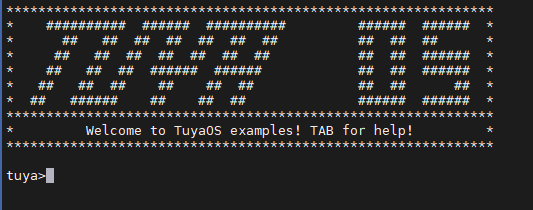
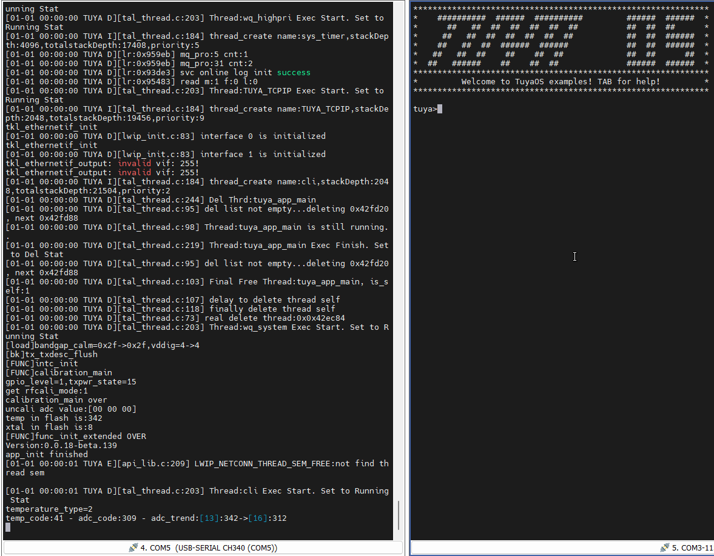

# TuyaOS demo examples

该项目的目的是为开发者提供一个 TuyaOS 的能力使用示例，该实例是基于 `TuyaOS` 进行开发。

该项目将所有提供的示例放到一个固件中，开发者只需将固件编译烧录后，通过使用命令行的方式调用不同的示例。

**重要：**

1. 示例中提供的 `UUID` 和 `AUTHKEY` （在 `apps/tuyaos_examples/src/tuya_device.c` 文件中）是无效的，所以如果烧录的芯片之前没有经过授权的话需要开发者自行获取授权码清单然后填入 `UUID` 和 `AUTHKEY` ，[点击查看如何获取授权码](https://developer.tuya.com/cn/docs/iot/lisence-management?id=Kb4qlem97idl0)。

2. 如果要烧录的芯片已经授权成功了，则只需将示例中的`UUID` 和 `AUTHKEY` （在 `apps/tuyaos_examples/src/tuya_device.c` 文件中）宏给注释掉，然后进行编译烧录后即可使用。

3. 在该实例中默认使用 `UART_NUM_0` 作为命令输入引脚，命令执行的结果通过日志打印口进行输出。

4. 部分示例由于芯片平台的不同可能会无法使用。

> 串口软件推荐使用 `MobaXterm` 软件。

## 1.如何使用该实例

### 1.1 编译

在 TuyaOS 的根目录下（包含有 `build_app.sh` 文件的目录下）执行下列命令进行对 `tuyaos_demo_examples` 的编译：

```bash
sh build_app.sh apps/tuyaos_demo_examples tuyaos_demo_examples 1.0.0
```

您也可以[点击查看](https://developer.tuya.com/cn/docs/iot-device-dev/tuyaos-wind-ide?id=Kbfy6kfuuqqu3#title-9-%E7%BC%96%E8%AF%91%E5%BA%94%E7%94%A8)如何通过使用 TuyaWind IDE 进行固件编译。

### 1.2 烧录

您可以[点击查看](https://developer.tuya.com/cn/docs/iot/flash-and-authorize?id=Kaytfatwdbfj2#title-7-%E4%BD%BF%E7%94%A8%E5%8E%9F%E5%8E%82%E5%B7%A5%E5%85%B7%E7%83%A7%E5%BD%95)如何使用原厂工具进行固件烧录。

### 1.3 运行示例

固件烧录成功，使用串口工具将电脑和模组进行连接，打开 `UART_NUM_0`  串口，重启芯片后   `UART_NUM_0`会出现由符号组成的 TUYA OS 的图像（如下图），则说明固件烧录成功。

  

按下 `tab` 键得到可执行的示例命令清单，在 `tuya>` 后面输入或复制粘贴不同的命令后按下回车键，芯片就会去执行不同的示例，您可以通过 `TUYA_UART_NUM_1` 串口看到输出对应示例的日志打印。命令输入和示例执行动图显示如下：



## 2. 注意事项

在示例中以下命令需要先调用 `example_soc_init` 命令对相关资源进行初始化之后才能调用：

+ example_ffc_ble

+ example_ffc_slave_init

+ example_health_manage

在示例中以下命令需要先调用 `example_soc_init` 命令并联网成功后才能调用：

+ example_update_device_status

+ example_soc_remove

+ example_dp_bool

+ example_dp_enum

+ example_dp_value

+ example_dp_str

+ example_dp_raw

+ example_http

+ example_http_download

+ example_tcp_server

+ example_tcp_client

> `example_http` 和 `example_http_download` 示例中的相关 API 已进行打码处理，如无正确修改，直接调用这两个示例会执行错误。并非所有示例在所有平台上都可以支持，部分示例由于芯片平台原因无法支持，如：rtl8720cf 芯片没有 ADC 。

```bash
tuyaos_examples
├── include
└── src
    ├── examples
    │   ├── driver_adc // adc 外设示例
    │   ├── driver_gpio // gpio 外设示例
    │   ├── driver_i2c // i2c 外设示例
    │   ├── driver_pwm // pwm 外设示例
    │   ├── driver_spi // spi 外设示例
    │   ├── driver_timer // 硬件定时器外设示例
    │   ├── os_ble // 蓝牙相关示例
    │   │   ├── ble_central
    │   │   └── ble_peripher
    │   ├── os_kv // key-value 数据库相关示例
    │   │   ├── kv_common
    │   │   ├── kv_fuzzy
    │   │   ├── kv_protect
    │   │   └── kv_tuya_db
    │   ├── os_rtc // rtc 相关示例
    │   ├── os_uf // 文件系统给相关示例
    │   │   ├── uf_db
    │   │   └── uf_file
    │   ├── os_watchdog // 看门狗示例
    │   ├── os_wifi // WiFi 相关示例
    │   │   ├── wifi_ap
    │   │   ├── wifi_low_power
    │   │   ├── wifi_scan
    │   │   └── wifi_sta
    │   ├── service_ble_remote // 蓝牙遥控器示例
    │   ├── service_ffc_master // ffc 主机相关示例
    │   ├── service_ffc_slaver // ffc 从机相关示例
    │   ├── service_health_manager // 固件健康管理示例
    │   ├── service_http
    │   ├── service_http_download
    │   ├── service_mf_test // 产测示例
    │   ├── service_soc_device // 联网单品初始化、不同数据类型上报示例
    │   ├── system_mutex
    │   ├── system_network
    │   │   ├── tcp_client
    │   │   └── tcp_server
    │   ├── system_queue
    │   ├── system_semaphore
    │   ├── system_sw_timer
    │   └── system_thread
    │   /* 命令行相关功能 */
    ├── tuya_cli.c  
    ├── tuya_cli_register.c
    ├── tuya_device.c
    └── tuya_uart.c
```

## 3. 技术支持

您可以通过以下方法获得涂鸦的支持:

+ TuyaOS 论坛：[https://www.tuyaos.com](https://www.tuyaos.com) 

+ 开发者中心：[https://developer.tuya.com](https://developer.tuya.com) 

+ 帮助中心：[https://support.tuya.com/help](https://support.tuya.com/help) 

+ 技术支持工单中心：[https://service.console.tuya.com](https://service.console.tuya.com) 
