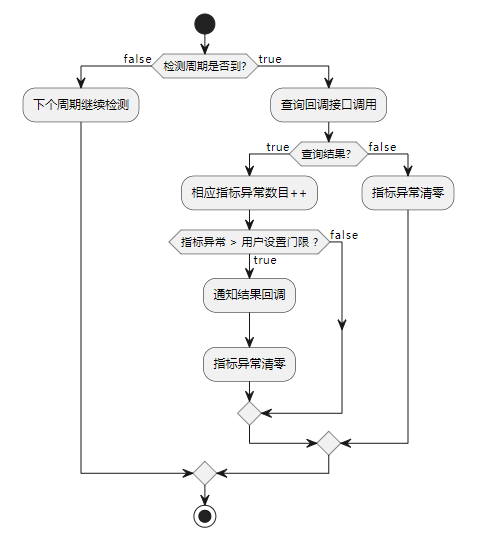

# HEALTH MANAGER 简介

这个项目将会介绍如何使用 `tuyaos healthy manager ` 相关接口，进行健康监控。

> 注意：在使用健康管理实例 `example_health_manage` 命令之前确保之前已经调用过 `example_soc_init` 命令初始化了健康管理。

## 简介

根据健康项创建时设置的周期时间，周期性的去扫描建立的的健康项，在达到触发条件后，触发通知回调。

健康检测中的 0-8 项被 TuyaOS 使用，用来打印系统剩余内存空间，运行时间，喂看门狗... 等数据，在健康管理中可以将管理项分为查询型和事件型：

+ 查询型：该类指标主要用于检测特别的信息。

+ 事件型：该类指标主要是触发了特别的状态。

健康组件相关函数原型如下，其中查询回调 `query` 可为 NULL ：

```c
typedef VOID (*health_notify_cb)();
typedef BOOL_T(*health_query_cb)();

/**
 * @brief add health item
 *
 * @param[in] threshold threshold
 * @param[in] period period
 * @param[in] query query cb
 * @param[in] notify notify cb
 *
 * @return type id, success when large than 0,others failed
 */
INT_T tuya_devos_add_health_item(UINT_T threshold, UINT_T period, health_query_cb query, health_notify_cb notify);
```


Tuya OS 默认使用的指标：

```c
typedef INT_T HEALTH_MONITOR_RULE_E;
#define HEALTH_RULE_FREE_MEM_SIZE 0
#define HEALTH_RULE_MAX_MEM_SIZE 1
#define HEALTH_RULE_ATOP_REFUSE 2
#define HEALTH_RULE_ATOP_SIGN_FAILED 3
#define HEALTH_RULE_WORKQ_DEPTH 4
#define HEALTH_RULE_MSGQ_NUM 5
#define HEALTH_RULE_TIMER_NUM 6
#define HEALTH_RULE_FEED_WATCH_DOG 7
#define HEALTH_RULE_RUNTIME_REPT 8
```

应用指标的申请从SDK的默认指标后面开始增加，为了简单起见，当删除指标再申请的时候，指标ID不回滚，依次递增，直到等于128，当到达128后，不再申请新的指标。

 健康管理状态机如下：



## 运行结果

```
[01-01 00:00:46 TUYA N][lr:0x713a1] Make sure you have called "example_soc_init" before executing this example.
[01-01 00:00:46 TUYA D][lr:0x89b29] add new node,type:9
[01-01 00:00:49 TUYA N][lr:0x71391] Find error, return TRUE.
[01-01 00:00:50 TUYA D][lr:0x9787f] lan listen select timeout
[01-01 00:00:54 TUYA N][lr:0x71391] Find error, return TRUE.
[01-01 00:00:59 TUYA D][lr:0x882b9] set time by rtc
[01-01 00:00:59 TUYA N][lr:0x71391] Find error, return TRUE.
[01-01 00:00:59 TUYA N][lr:0x71381] Health event type notify callback
```

**在实例中为了方便查看现象，所以将周期 `period` 设置的较小（最小可以设置为 5 S），在实际开发中应根据实际情况设置一个合理的周期时间，避免频繁调用，浪费资源。**

## 技术支持

您可以通过以下方法获得涂鸦的支持:

- TuyaOS 论坛： https://www.tuyaos.com

- 开发者中心： https://developer.tuya.com

- 帮助中心： https://support.tuya.com/help

- 技术支持工单中心： https://service.console.tuya.com
