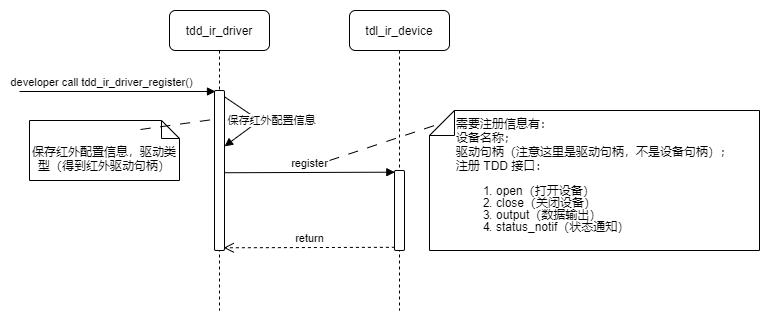
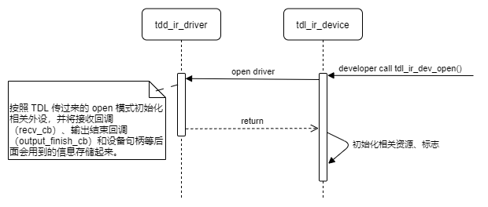
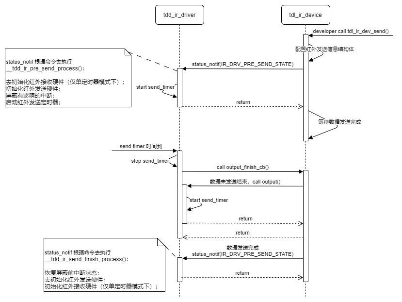
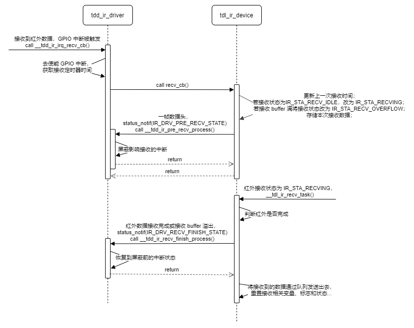

# 红外驱动适配指南

本文档主要是对红外驱动（TDD）的相关介绍，方便开发者适配新的红外驱动。TDD 层主要是对硬件的控制，红外发送和接收的逻辑是在 TDL 层进行实现的，所以在 TDD 层中数据的发送和接收都是一个一个数据的进行传入传出的，而不关心整条红外码是什么样子的。

红外硬件要求：

+ PWM 支持 38KHz 频率输出
+ 微秒级定时器
+ （通用）IO 中断支持边沿触发（最好为双边沿）
+ （非必选）PWM 输入捕获支持双边沿触发

## TDD 层需实现的接口功能

TDD 需要实现 5 个接口，设备注册（tdd_ir_driver_register）、设备开启（open）、设备关闭（close）、单数据输出（output) 和设备状态通知（status notify) 五个接口

+ tdd_ir_driver_register
+ __tdd_ir_drv_open
+ __tdd_ir_drv_close
+ __tdd_ir_drv_output
+ __tdd_ir_drv_status_notification

开发者通过调用设备注册这个接口选择不同的红外驱动方式驱动，单定时器驱动、双定时器驱动和捕获方式驱动三种驱动方式，这三种驱动方式的不同会在下文中进行介绍。

设备开启（open）、设备关闭（close）、单数据输出（output) 和设备状态通知（status notify) 四个接口则是为 TDL 层提供的。

### 1. 设备注册

TDD 层的设备注册接口的主要功能有：

+ 选择驱动类型
  + 单定时器：红外发送和接收使用一个微妙级硬件定时器，不可以在红外发送时接收红外数据。
  + 双定时器：红外发送和接收分别使用一个微妙级硬件定时器，可在红外发送的同时接收红外数据。
  + 捕获方式：需要硬件支持 PWM 输入捕获，使用 PWM 双边沿捕获 + 一个微妙级硬件定时器，可在红外发送的同时接收红外数据。
+ 选择驱动红外驱动硬件
+ 注册红外设备

设备开启（open）、设备关闭（close）、单数据输出（output) 和设备状态通知（status notify) 四个接口在注册时通过 `tdl_ir_dev_register` 将这四个接口传到 TDL 层，之后 TDL 层通过回调的方式调用这四个接口。

函数原型如下：

```c
int tdd_ir_driver_register(const char *dev_name, IR_DRIVER_TYPE_E driver_type, IR_DRV_CFG_T drv_cfg);
```

开发者通过调用 `tdd_ir_driver_register` 函数将红外驱动的硬件配置信息（`driver_type `、`drv_cfg `）存储起来（也就是驱动句柄 `IR_DRV_INFO_T`），然后通过调用 `tdl_ir_dev_register` 函数将驱动名称、驱动句柄和上面介绍的四个接口传到 TDL 层。



### 2. 设备开启

当开发者调用 `tdl_ir_dev_open` 函数时，该函数会调用由 TDD 层传过来的 `open` 回调函数并初始化相关资源。

 `open` 回调函数原型如下：

---

```c
int (*open)(IR_DRV_HANDLE_T drv_hdl, unsigned char mode, IR_TDL_TRANS_CB ir_tdl_cb, void *args);
```

> 根据传入的模式，打开红外所以的硬件，并将传入的必要信息保存起来。

**Parameters:**

+ <font color="#dd0000">`drv_hdl`:</font> 红外驱动句柄。
+ <font color="#dd0000">`mode`:</font> 红外开启的模式，有仅发送，仅接收和发送接收三种模式。
+ <font color="#dd0000">`ir_tdl_cb`:</font> tdl 层传给 tdd 层的回调函数。
+ <font color="#dd0000">`args`:</font> 用来传入红外的 tdl 句柄，后面进行红外发送接收可以将该句柄通过回调函数参数的方式传给 TDL 。

**Return:**

+ <font color="#dd0000">`OPRT_OK`:</font>  函数执行成功。
+ <font color="#dd0000">`other`:</font>  函数执行失败。

---

这里需要详细说明的是 `IR_TDL_TRANS_CB` ，他是一个由回调函数组成的结构体，其原型如下：

```c
/* tdl_ir_driver.h */
typedef int (*IR_DRV_OUTPUT_FINISH_CB)(void *args);
typedef int (*IR_DRV_RECV_CB)(IR_DRV_HANDLE_T drv_hdl, unsigned int raw_data, void *args);

typedef struct {
    IR_DRV_OUTPUT_FINISH_CB output_finish_cb;
    IR_DRV_RECV_CB          recv_cb;
}IR_TDL_TRANS_CB;
```

`output_finish_cb` 回调函数时一个数据发送完成后会调用该函数由 TDL 层进行判断是准备下一个数据进行发送还是这一帧红外数据发送完成。`recv_cb` 回调函数是在接收到红外数据后被调用，将原始数据传给 TDL 层，接收完成判断也是有 TDL 层进行判断。关于这两个函数具体的介绍会在下文中的红外发送，接收中进行详细的介绍。

TDD 和 TDL 的设备开启交互图如下：



### 3. 设备关闭

当开发者调用 `tdl_ir_dev_close` 函数时，该函数会调用由 TDD 层传过来的 `close` 回调函数并关闭相关资源。该功能比较简单，这里就不在进行过多介绍。

`close` 回调函数原型如下：

---

```c
int (*close)(IR_DRV_HANDLE_T drv_hdl, unsigned char mode);
```

> 关闭红外设备硬件

**Parameters:**

+ <font color="#dd0000">`drv_hdl`:</font> 红外驱动句柄。
+ <font color="#dd0000">`mode`:</font> 红外开启的模式，有仅发送，仅接收和发送接收三种模式。

**Return:**

+ <font color="#dd0000">`OPRT_OK`:</font>  函数执行成功。
+ <font color="#dd0000">`other`:</font>  函数执行失败。

---

### 4. 状态通知

当开发者调用 `tdl_ir_config` 函数时，该函数会调用该回调函数 `status_notif`。对于 `tdl_ir_config` 函数会有多个命令，其中和硬件相关的几个命令会用到`status_notif` 回调函数进行操作硬件。

`status_notif` 回调函数原型如下：

---

```c
int (*status_notif)(IR_DRV_HANDLE_T drv_hdl, IR_DRIVER_STATE_E state, void *args);
```

> 状态通知函数， TDL 层通过调用该函数设置模式或获取一些状态数据。

**Parameters:**

+ <font color="#dd0000">`drv_hdl`:</font> 红外驱动句柄。
+ <font color="#dd0000">`state`:</font> 要设置的红外驱动状态（命令）。
+ <font color="#dd0000">`args`:</font> 其他需要传入或传出的参数（根据具体的命令进行使用）。

**Return:**

+ <font color="#dd0000">`OPRT_OK`:</font>  函数执行成功。
+ <font color="#dd0000">`other`:</font>  函数执行失败。

---

在红外组件的 TDD 层中需要实现的 `state` 有以下几种：

+ `IR_DRV_PRE_SEND_STATE`：红外预发送状态，初始化红外发送所需的硬件资源。应根据实际的硬件情况进行适配，如：如果有中断影响了定时器的工作，导致红外发送接收不准确，应屏蔽掉相关的中断。在单硬件定时器模式下，去使能红外接收硬件，使能红外发送硬件。这里这么操作是因为单定时器模式下由于红外发送和接收使用的同一个硬件定时器，双硬件定时器模式或 PWM 捕获模式下无需这样操作。
+ `IR_DRV_SEND_FINISH_STATE`：红外发送结束状态，红外发送完成后需要处理的硬件操作。在单定时器模式下，应将硬件定时器切换为红外接收的状态，如果有屏蔽中断的操作，应将中断配置恢复到发送前的状态。
+ `IR_DRV_PRE_RECV_STATE`：红外预接收状态，红外数据接受前需要进行的硬件配置。处于这个状态则说明已经接收到了一个数据，所以这里的主要操作的屏蔽掉会有影响的中断（如果没有，则无需做任何操作）。
+ `IR_DRV_RECV_FINISH_STATE`：红外接收完成状态，红外数据接收完成后需要进行的硬件配置。如果在预发送操作中有屏蔽中断的操作，这里应恢复到接收前的状态（如果没有，则无需做任何操作）。
+ `IR_DRV_SEND_HW_RESET`：红外发送硬件重新初始化。
+ `IR_DRV_RECV_HW_DEINIT`：红外接收硬件去初始化。用户调用该状态去初始化接收硬件后，则必须由用户再次调用 `IR_DRV_RECV_HW_INIT` 状态初始化红外接收硬件后才能初始化红外接收硬件。
+ `IR_DRV_RECV_HW_INIT`：红外接收硬件初始化。

其中 `IR_DRV_SEND_HW_RESET`、`IR_DRV_RECV_HW_DEINIT` 和 `IR_DRV_RECV_HW_INIT` 三种对于硬件的操作会在 `tbl_ir_cloud_service` 组件中被使用到，其他四种会在 `tdl_ir_device` 中被使用到，会在下文中进行介绍。

### 4. 红外发送

这里为了介绍简单，就以时间码的进行举例不涉及编解码相关的介绍。开发者调用 `tdl_ir_dev_send` 函数发送红外时，会先进行发送信息初始化（发送频率、数据、长度、发送次数和发送索引）。然后调用 `status_notif` 回调函数，发送红外预发送命令 `IR_DRV_PRE_SEND_STATE` ， TDD 层在接收到预发送命令之后如果当前硬件驱动模式为单定时器模式（ `IR_DRV_SINGLE_TIMER` ）会先去初始化红外接收硬件，然后初始化红外发送硬件，如果有屏蔽中断的必要会屏蔽中断，然后启动红外发送。

启动红外发送也就是开启发送硬件定时器，定时器时间到了后会执行红外发送定时器回调函数 `__tdd_ir_timer_send_cb` ，`__tdd_ir_timer_send_cb` 会先停掉对应的硬件定时器，然后调用在 `open` 时提供的输出接收回调 `output_finish_cb`（这里的输出完成是指一个数据的输出完成）。在 `output_finish_cb` 函数中会判断发送完成的数据是否为最后一个数据。

+ 如果不是最后一个数据 `output_finish_cb` 会更新发送索引 `send_idx` ，计算输出 PWM 还是低电平，然后调用 TDD 提供的数据输出回调函数 `output` 将这一个数据发送出去。

+ 如果是最后一个数据则说明这一帧数据发送完成，会调用 `status_notif` 使用 `IR_DRV_SEND_FINISH_STATE` 状态通知 TDD 发送完成，TDD 层会先恢复发送的中断状态，然后如果是单定时器模式（ `IR_DRV_SINGLE_TIMER` ）会去初始化红外发送硬件，初始化红外接收硬件。

`output_finish_cb` 回调函数原型如下：

```c
/* tdl_ir_driver.h */
typedef int (*IR_DRV_OUTPUT_FINISH_CB)(void *args); /* args 应为红外设备句柄，由 TDD 传入 */
```

`output` 回调函数原型如下：

```c
/* tdl_ir_driver.h */
int (*output)(IR_DRV_HANDLE_T drv_hdl, unsigned int freq, unsigned char is_active, unsigned int time_us);
```

红外数据发送时， TDD 和TDL 层交互图如下：



### 5. 红外接收

使用捕获的方式进行接收红外数据会进入到对应的捕获中断函数；其他两种方式则是使用 GPIO 中断的原理实现的，接收到红外数据后进入到触发 GPIO 中断进入到对应的 GPIO 中断服务函数中去。由于 GPIO 中断方式更为通用些，下面将使用GPIO 中断原理的方式进行介绍。

当接收到红外数据后会进入到 GPIO 中断服务函数，在中断服务函数 `__tdl_ir_recv_cb` 中，先去使能红外接收引脚的 GPIO 中断，然后读取当前红外接收硬件定时器的计数值，然后减去上一次的计数值得到差值（这个差值也就是时间码的数据）通过 TDL 在 `open` 时传下来的 `recv_cb（回调函数为：__tdl_ir_recv_cb）` 函数将数据传到 TDL ，在 `recv_cb（回调函数为：__tdl_ir_recv_cb）` 函数中会将原始数据存储下来，并更新接收索引。最后更新 GPIO 中断触发类型（如果是单边沿触发的），使能 GPIO 中断。在这个过程中有两个需要注意的时间点，一个首次接收到数据，一个是一帧数据接收完成。

首次接收到数据时 ，TDD 层通过 `recv_cb（回调函数为：__tdl_ir_recv_cb）` 函数将数据传到 TDL 层， TDL 层会调用 `status_notif` 使用 `IR_DRV_PRE_RECV_STATE` 状态通知 TDD 准备开始接收数据，TDD 层在接收到 `IR_DRV_PRE_RECV_STATE` 状态后会屏蔽掉对红外接收有影响的中断（如果没有的话则不用屏蔽）。

一帧数据的结束是根据上一个数据过去的时间是否超过了设置的时间来决定是否这一帧数据是否接收完成了的。当 TDL 层判断数据接收完成后（在 `__tdl_ir_recv_task` 中进行判断的），会调用 `status_notif` 使用 `IR_DRV_RECV_FINISH_STATE` 状态通知 TDD 层红外接收完成，TDD 层会将屏蔽的中断恢复到屏蔽前的状态并将相关的接收标志进行初始化。

TDD 和 TDL 层数据交互图如下，这里不同颜色代表三种不同情况，蓝色为一帧数据的开始，绿色为数据正在接收中，红色为一帧数据接收完成或接收 buffer 满的情况：


